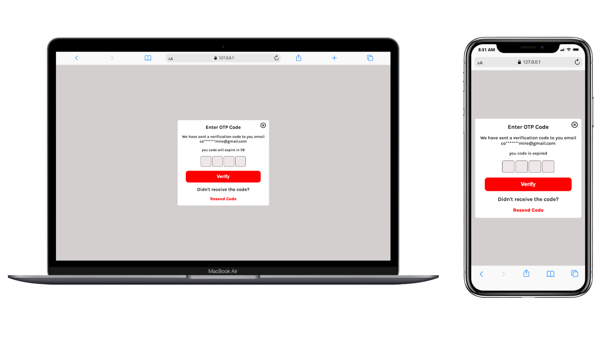

<p align="center">
  
</p>

# 🚀 OTP Verification – Modern UI

This project is a clean and modern **OTP Verification UI** designed using **HTML**, **CSS**, and **JavaScript**.  
It provides a user-friendly interface for entering a 4-digit OTP, includes a **countdown timer**, auto-focus inputs, and a **resend code** option.

---

## 📸 Preview



---

## 🔗 Live Demo

<p align="center">
  <a href="https://anujghimire08.github.io/Modern-OTP-Verification-UI/">
   
  </a>
</p>

The UI contains:

- A header showing the OTP input instruction
- 4 single-character input fields
- Countdown timer for OTP expiration (`1:00 → 0:00`)
- Resend code functionality
- Verification button
- Close icon for UX

---

## 🛠️ Technologies Used

- **HTML5**
- **CSS3** (Glassmorphism-style design)
- **JavaScript** (Countdown, auto-focus inputs, resend code)
- **Font Awesome 7.0.1**
- **Responsive layout for mobile devices**

---

## 📁 Project Structure

```
│── index.html
│── style.css
│── script.js
│── DevicePreview
│── README.md
```
